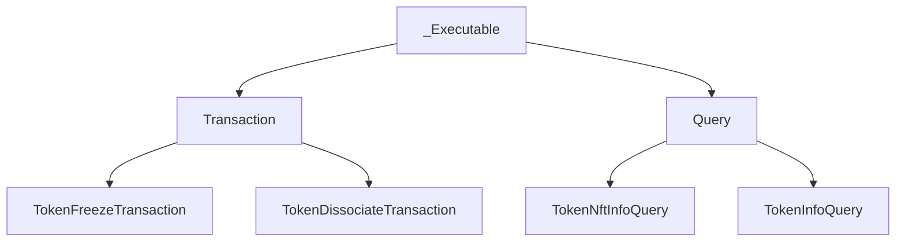

# _Executable Class Training

## Table of Contents

- [Introduction to _Executable](#introduction-to-_executable)
- [Execution Flow](#execution-flow)
- [Retry Logic](#retry-logic)
- [Exponential backoff](#exponential-backoff)
- [Error Handling](#error-handling)
- [Logging & Debugging](#logging--debugging)
- [Practical Examples](#practical-examples)

## Introduction to _Executable
 * The _Executable class is the backbone of the Hedera SDK execution engine. It handles sending transactions and queries, retry logic, error mapping, and logging, allowing child classes (like Transaction and Query) to focus on business logic.




## Execution Flow

 - How _execute(client) works in the Hedera SDK?

  The typical execution flow for transactions and queries using the Executable interface follows these steps:

   1. **Build** → Create the transaction/query with required parameters
   2. **FreezeWith(client)** → Locks the transaction for signing
   3. **Sign(privateKey)** → Add required signatures
   4. **Execute(client)** → Submit to the network
   5. **GetReceipt(client)** → Confirm success/failure


 - Here’s how child classes hook into the execution pipeline:

  | Command | Description |
  | --- | --- |
  | `_make_request` | Build the protobuf request for this operation. Example: a transaction class serializes its body into a Transaction proto; a query class builds the appropriate query proto. |
  | `_get_method(channel: _Channel) -> _Method` | Choose which gRPC stub method to call. You get service stubs from channel, then return _Method(transaction_func=...) for transactions or _Method(query_func=...) for queries. The executor calls _execute_method, which picks transaction if present, otherwise query. |
  | `_map_status_error(response)` | Inspect the network response status and convert it to an appropriate exception (precheck/receipt). This lets the executor decide whether to raise or retry based on _should_retry. |
  | `_should_retry(response) -> _ExecutionState` | _ExecutionState: Decide the execution state from the response/status: RETRY, FINISHED, ERROR, or EXPIRED. This drives the retry loop and backoff. |
  | `_map_response(response, node_id, proto_request)` | Convert the raw gRPC/Proto response into the SDK’s response type (e.g., TransactionResponse, Query result) that gets returned to the caller. |


## Retry Logic
 - Core Logic:
  1. Loop up to max_attempts times — The outer for loop tries the operation multiple times
  2. Exponential backoff — Each retry waits longer than the previous one
  3. Execute and check response — After execution, determine if we should retry, fail, or succeed
  4. Smart error handling — Different errors trigger different actions


**_Retry logic = Try the operation, wait progressively longer between attempts, pick a different node if needed, and give up after max attempts. This makes the system resilient to temporary network hiccups._**


## Exponential backoff
Key Steps:

 * First retry: wait `_min_backoff` ms
 * Second retry: wait 2× that
 * Third retry: wait 4× that (doubling each time)
 * Stops growing at `_max_backoff`

  _(Why? Gives the network time to recover between attempts without hammering it immediately.)_

 Handling gRPC errors:
 ```python
 except grpc.RpcError as e:
     err_persistant = f"Status: {e.code()}, Details: {e.details()}"
     node = client.network._select_node()  # Switch nodes
     logger.trace("Switched to a different node...", "error", err_persistant)
     continue  # Retry with new node
 ```
 Retryable gRPC codes:

  * `UNAVAILABLE — Node` down/unreachable
  * `DEADLINE_EXCEEDED` — Request timeout
  * `RESOURCE_EXHAUSTED` — Rate limited
  * `INTERNAL` — Server error

  _(If the [gRPC](https://en.wikipedia.org/wiki/GRPC) call itself fails, switch to a different network node and retry.)_

## Error Handling

 * Mapping network errors to Python exceptions
   Abstract method that child classes implement:
   ```python
   @abstractmethod
   def _map_status_error(self, response):
       """Maps a response status code to an appropriate error object."""
       raise NotImplementedError(...)
   ```

   - Precheck errors --> PrecheckError (e.g., invalid account, insufficient balance)
   - Receipt errors --> ReceiptStatusError (e.g., transaction executed but failed)
   - Other statuses --> Appropriate exception types based on the status code


* Retryable vs Fatal Errors
  Determined by `_should_retry(response) → _ExecutionState`:

   ```python
   @abstractmethod
   def _should_retry(self, response) -> _ExecutionState:
       """Determine whether the operation should be retried based on the response."""
       raise NotImplementedError(...)
   ```

  The response is checked via `_should_retry()` which returns one of four `Execution States`:

    | State          | Action                                  |                                        
    | :--------------| :---------------------------------------| 
    | **RETRY**      | `Wait (backoff), then loop again`       | 
    | **FINISHED**   | `Success! Return the response`          | 
    | **ERROR**      | `Permanent failure, raise exception`    |
    | **EXPIRED**    | `Request expired, raise exception`      | 


## Logging & Debugging

- Request ID tracking
  * Unique request identifier per operation:
  ```python
  def _get_request_id(self):
      """Format the request ID for the logger."""
      return f"{self.__class__.__name__}:{time.time_ns()}"
  ```
  * Format: `ClassName:nanosecond_timestamp` (e.g., `TransferTransaction:1702057234567890123`)
  * Unique per execution, allowing you to trace a single operation through logs
  * Passed to every logger call for correlation

  * Used throughout execution:
   ```python
   logger.trace("Executing", "requestId", self._get_request_id(), "nodeAccountID", self.node_account_id, "attempt", attempt + 1, "maxAttempts", max_attempts)
   logger.trace("Executing gRPC call", "requestId", self._get_request_id())
   logger.trace("Retrying request attempt", "requestId", request_id, "delay", current_backoff, ...)
   ```

  * At each attempt start:
   ```python
   logger.trace(
    "Executing",
    "requestId", self._get_request_id(),
    "nodeAccountID", self.node_account_id,      # Which node this attempt uses
    "attempt", attempt + 1,                      # Current attempt (1-based)
    "maxAttempts", max_attempts                  # Total allowed attempts
   )
  ```
  * During gRPC call:
  ```python
  logger.trace("Executing gRPC call", "requestId", self._get_request_id())
  ```
  * After response received:
  ```python
    logger.trace(
    f"{self.__class__.__name__} status received",
    "nodeAccountID", self.node_account_id,
    "network", client.network.network,          # Network name (testnet, mainnet)
    "state", execution_state.name,               # RETRY, FINISHED, ERROR, EXPIRED
    "txID", tx_id                                # Transaction ID if available
  )
  ```

  * Before backoff/retry:
  ```python
    logger.trace(
    f"Retrying request attempt",
    "requestId", request_id,
    "delay", current_backoff,                    # Milliseconds to wait
    "attempt", attempt,
    "error", error                               # The error that triggered retry
  )
  time.sleep(current_backoff * 0.001)              # Convert ms to seconds
  ```
  * Node switch on gRPC error:
  ```python
    logger.trace(
    "Switched to a different node for the next attempt",
    "error", err_persistant,
    "from node", self.node_account_id,           # Old node
    "to node", node._account_id                  # New node
  )
  ```
  * Final failure:
  ```python
    logger.error(
    "Exceeded maximum attempts for request",
    "requestId", self._get_request_id(),
    "last exception being", err_persistant
  )
  ```

- Tips for debugging transaction/query failures
1. Enable Trace Logging
 * Capture detailed execution flow:
 ```python
 client.logger.set_level("trace")  # or DEBUG
 ```
  * What you'll see:
 - _Every attempt number_
 - _Node account IDs being used_
 - _Backoff delays between retries_
 - _Status received at each stage_
 - _Node switches on errors_

2. Identify the Failure Type by Execution State
Execution State Flow:
```
┌─ RETRY (0)
│  ├─ Network hiccup (gRPC error)
│  ├─ Temporary node issue
│  └─ Rate limiting (try after backoff)
│
├─ FINISHED (1)
│  └─ Success ✓ (return response)
│
├─ ERROR (2)
│  ├─ Precheck error (bad input)
│  ├─ Invalid account/permissions
│  ├─ Insufficient balance
│  └─ Permanent failure
│
└─ EXPIRED (3)
   └─ Transaction ID expired (timing issue)
```

3. Track Backoff Progression
 Exponential backoff indicates retryable errors:
 ```text
  Attempt 1: (no backoff, first try)
  Attempt 2: delay 250ms
  Attempt 3: delay 500ms
  Attempt 4: delay 1000ms (1s)
  Attempt 5: delay 2000ms (2s)
  Attempt 6: delay 4000ms (4s)
  Attempt 7: delay 8000ms (8s, capped)
  Attempt 8+: delay 8000ms (stays capped)
  ```
  Interpretation:
   * => Growing delays: System is retrying a transient issue → healthy behavior
   * => Reaches cap (8s) multiple times: Network or node is struggling
   * => Fails immediately (no backoff): Permanent error(precheck/validation)
4. Monitor Node Switches
Watch for node switching patterns in logs:
  ```text
  Switched to a different node
  from node: 0.0.3
  to node: 0.0.4
  error: Status: UNAVAILABLE, Details: Node is offline
 ```
Healthy patterns:
 * => Few switches (1-2 per 3+ attempts)
 * => Changes due to network errors (gRPC failures)

Problem patterns:
 * => Rapid switches (multiple per attempt)
 * => All nodes fail → network-wide issue
 * => Always same node fails → that node may be down

5. Cross-Reference Transaction ID with Hedera Explorer
  For transactions, use the transaction ID to verify on the network:
  ```
  # From logs, capture txID
  txID: "0.0.123@1702057234.567890123"

  # Query Hedera mirror node
  curl https://testnet.mirrornode.hedera.com/api/v1/transactions/0.0.123-1702057234-567890123
  ```
 What you'll find:
 * => Actual execution result on the network
 * => Receipt status
 * => Gas used (for contract calls)
 * => Confirms if transaction made it despite client-side errors

6. Debug Specific Error Scenarios

| Error             | Cause                       | Debug Steps                                       |
| :---              | :---:                       | :---:                                             |
| MaxAttemptsError  | Failed after max retries    | Check backoff log; all nodes failing?             |
| PrecheckError     | Bad request (immediate fail)| Validate: account ID, amount, permissions         |
| ReceiptStatusError| Executed but failed         | Check transaction details, balance, contract logic|
| gRPC RpcError     | Network issue               | Check node status, firewall, internet             |
| EXPIRED state     | Transaction ID too old      | Use fresh transaction ID, check system clock      |

7. Practical Debugging Workflow
  * Step 1: Capture the request ID
   ```
   From error output: requestId = TransferTransaction:1702057234567890123
   ```

  * Step 2: Search logs for that request ID
   ```text
   grep "1702057234567890123" application.log
   ```

  * Step 3: Analyze the sequence
   ```
    [TRACE] Executing attempt=1 nodeAccountID=0.0.3 ...
    [TRACE] Executing gRPC call ...
    [TRACE] Retrying request delay=250ms ...
    [TRACE] Executing attempt=2 nodeAccountID=0.0.4 ...
    [TRACE] Switched to a different node error=Status: UNAVAILABLE ...
    [ERROR] Exceeded maximum attempts ...
   ```

  * Step 4: Determine root cause
    * => Multiple retries with node switches → Network issue
    * => Single attempt, immediate ERROR → Input validation issue
    * => EXPIRED after 1+ attempts → Timeout/clock issue

  * Step 5: Take action
    * => Network issue: Retry after delay, check network status
    * => Input issue: Fix account ID, amount, permissions
    * => Timeout: Increase max_backoff or check system clock

8. Enable Verbose Logging for Production Issues
  * For real-world debugging:
  ```python
   # Set higher log level before executing
   client.logger.set_level("debug")

   # Or configure structured logging
   import logging
   logging.basicConfig(level=logging.DEBUG, format='%(asctime)s - %(name)s - %(levelname)s - %(message)s')
  ```
  Captures:
   * => Request ID, attempt number, node ID
   * => Backoff delays and progression
   * => gRPC errors with status codes
   * => Final error message with context

Debug Checklist:

 * ✅ Confirm request ID appears in logs (means operation was attempted)
 * ✅ Count attempts (did it retry or fail immediately?)
 * ✅ Check execution states (RETRY → ERROR or RETRY → FINISHED?)
 * ✅ Note node switches (gRPC errors or single node?)
 * ✅ Verify backoff progression (exponential or capped?)
 * ✅ Match final error to exception type (Precheck, Receipt, MaxAttempts, etc.)
 * ✅ Cross-check transaction ID with Hedera explorer if available

This lets you quickly identify whether a failure is transient (network), permanent (bad input), or rate-related (backoff didn't help).

## Practical Examples
 * [Token Association Example](https://github.com/hiero-ledger/hiero-sdk-python/blob/main/examples/tokens/token_associate_transaction.py)
 * [Token Freeze Example](https://github.com/hiero-ledger/hiero-sdk-python/blob/main/examples/tokens/token_freeze_transaction.py)
 * [Token Account Info Query Example](https://github.com/hiero-ledger/hiero-sdk-python/blob/main/examples/query/account_info_query.py)

